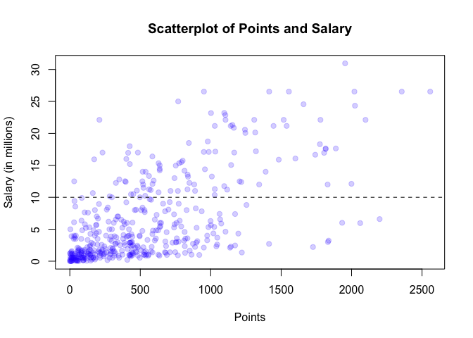
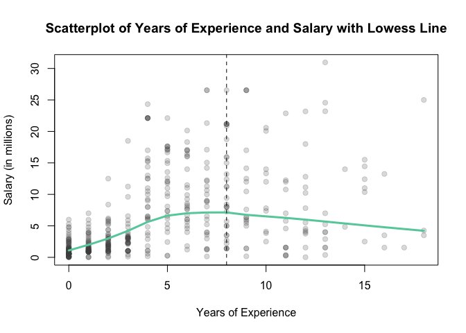
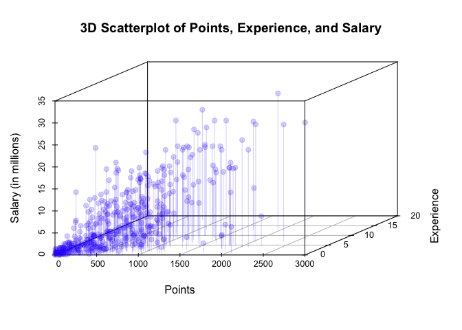
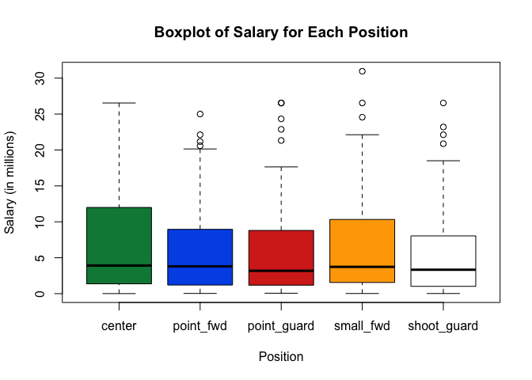

HW 01 - More Vectors
================
Bryant Luong
2017-09-23

### 0) Importing the data

``` r
knitr::opts_chunk$set(echo = TRUE)

# load data file
load("data/nba2017-salary-points.RData")

# list available objects
ls()
```

    ## [1] "experience" "player"     "points"     "points1"    "points2"   
    ## [6] "points3"    "position"   "salary"     "team"

### 1) A bit of data processing

``` r
# Create new vector for salaries in millions 
salary_millions <- salary/1000000
salary_millions <- round(salary_millions, digits = 2)

# Check that conversion worked
head(salary)
```

    ## [1] 26540100 12000000  8269663  1450000  1410598  6587132

``` r
head(salary_millions)
```

    ## [1] 26.54 12.00  8.27  1.45  1.41  6.59

``` r
# Create new experience vector by replacing 'R' with 0 and changing type of elements from char to int
experience_int <- experience
experience_int[experience_int == "R"] = 0
experience_int <- as.integer(experience_int)

# Check that new vector contains no 'R' and is type int
experience_int[experience_int == 'R']
```

    ## integer(0)

``` r
typeof(experience_int)
```

    ## [1] "integer"

``` r
# Create a factor for position vector
pos_fac <- factor(position, labels = c('center', 'power_fwd', 'point_guard', 'small_fwd', 'shoot_guard'))
table(pos_fac)
```

    ## pos_fac
    ##      center   power_fwd point_guard   small_fwd shoot_guard 
    ##          89          89          85          83          95

### 2) Scatterplot of Points and Salary

``` r
# Create scatterplot of points and salary
plot(points, 
     salary_millions, 
     main = 'Scatterplot of Points and Salary', 
     xlab = 'Points', 
     ylab = 'Salary (in millions)', 
     pch = 21, 
     col = rgb(0.2, 0.2, 1.0, 0.2), 
     bg = rgb(0.2, 0.2, 1.0, 0.2), 
     cex = 1)

# Add horizontal line at $10 million
abline(h = 10, lty = 2)
```



Observations of scatterplot:

1.  The cluster of points in the bottom left corner of the scatterplot means most players scored below 500 points last season and had a salary below $5 million.

2.  There are 3 players who scored around 2,000 points last season but had salaries close to $5 million and 3 players who scored between 1,600 and 1,900 points and had salaries close to $2.5 million.

3.  The player that scored the most points **did not** have the highest salary. The player with the highest salary scored about 2,000 points.

4.  If the 6 players mentioned in the first observation are excluded, there is graphical evidence that salary is correlated with points.

5.  However, the correlation appears to be weak because at each salary level there is a lot of variation in the number of points scored. For example, for players who had a salary near $10 million dollars, which is represented by the dotted line, some players scored less than 500 points and some players scored above 1,000 points.

6.  There is a player whose salary is about $23 million and has scored less than 250 points.

### 3) Correlation between Points and Salary

``` r
# number of individuals
n <- length(player)
n
```

    ## [1] 441

``` r
# summary of statistics for variable X (points)
mean_points <- sum(points)/n
mean_points
```

    ## [1] 546.6054

``` r
variance_points <- (1 / (n - 1)) * sum((points - mean_points)^2)
variance_points
```

    ## [1] 239136.2

``` r
stddev_points <- sqrt(variance_points)
stddev_points
```

    ## [1] 489.0156

``` r
# summary of statistics for variable Y (salary)
mean_salary <- sum(salary_millions)/n
mean_salary
```

    ## [1] 6.186689

``` r
variance_salary <- (1 / (n - 1)) * sum((salary_millions - mean_salary)^2)
variance_salary
```

    ## [1] 43.19524

``` r
stddev_salary <- sqrt(variance_salary)
stddev_salary
```

    ## [1] 6.572309

``` r
# covariance of X and Y
covar_PS <- (1 / (n - 1)) * sum((points - mean_points) * (salary_millions - mean_salary))
covar_PS
```

    ## [1] 2046.424

``` r
# correlation of X and Y
cor_PS <- covar_PS / (stddev_points * stddev_salary)
cor_PS
```

    ## [1] 0.6367296

### 4) Simple Linear Regression

``` r
# Calculate slope of data using correlation and standard deviations
slope <- cor_PS * (stddev_salary / stddev_points)
slope
```

    ## [1] 0.008557567

``` r
# Calculate intercept of data using mean of points and salary and slope
intercept <- mean_salary - mean_points * slope
intercept
```

    ## [1] 1.509077

``` r
# Create vector of predicted salaries 
y_hat <- intercept + slope * points
```

##### Summary Statisics of Predicted Values

``` r
summary(y_hat)
```

    ##    Min. 1st Qu.  Median    Mean 3rd Qu.    Max. 
    ##   1.509   2.844   5.206   6.187   8.184  23.399

##### Regression Equation

Symbolically, the simple linear regression equation is `y_hat = intercept + slope * points`. Numerically, the simple linear regression equation is `y_hat = 1.51 + 0.0086 * points`.

##### How do you interpret the slope coefficient?

The slope coefficient shows the average increase in annual salary per point. In other words, a player can earn approximately $8,600 for each point scored during the season.

##### How do you interpret the intercept?

The intercept shows the average baseline salary. If the player doesn't score any points, the player has a salary near the intercept salary, which is $1.5 million.

##### What is the predicted salary (in millions) for a player that scores:

##### 0 points

``` r
intercept + slope * 0
```

    ## [1] 1.509077

##### 100 points

``` r
intercept + slope * 100
```

    ## [1] 2.364833

##### 500 points

``` r
intercept + slope * 500
```

    ## [1] 5.78786

##### 1000 points

``` r
intercept + slope * 1000
```

    ## [1] 10.06664

##### 2000 points

``` r
intercept + slope * 2000
```

    ## [1] 18.62421

### 5) Plotting the regression line

``` r
# plot data in scatter plot
plot(points, 
     salary_millions, 
     main = 'Scatterplot of Points and Salary with Regression and Lowess Lines', 
     xlab = 'Points', 
     ylab = 'Salary (in millions)', 
     pch = 21, 
     col = rgb(0.3, 0.3, 0.3, 0.2), 
     bg = rgb(0.3, 0.3, 0.3, 0.2), 
     cex = 1)

# Add simple linear regression line to plot
abline(a = intercept, 
       b = slope, 
       lty = 1, 
       lwd = 3, 
       col = '#458b00')

# Add lowess line to plot
lines(lowess(points, salary_millions), 
      lty = 1, 
      lwd = 3, 
      col= '#8b0046')

# Add 'lowess' label to plot
text(x = 2500, 
     y = 30, 
     labels = 'lowess', 
     col = '#8b0046', 
     cex = 0.8)

# Add 'regression' label to plot
text(x = 2490, 
     y = 20, 
     labels = 'regression', 
     col = '#458b00', 
     cex = 0.8)
```


### 6) Regression Residuals and Coefficient of Determination

``` r
# Calculate residuals and store them in a vector
residuals <- salary_millions - y_hat
summary(residuals)
```

    ##    Min. 1st Qu.  Median    Mean 3rd Qu.    Max. 
    ## -14.187  -2.792  -1.095   0.000   2.556  18.814

``` r
# Calculate the RSS and store them in a vector
rss <- sum(residuals * residuals)
rss
```

    ## [1] 11300.45

``` r
# Calculate the TSS and store them in a vector
tss <- sum((salary_millions - mean_salary)^2)
tss
```

    ## [1] 19005.91

``` r
# Calculate the coefficient of determination
r_sqrd <- 1 - (rss / tss)
r_sqrd
```

    ## [1] 0.4054246

### 7) Exploring Position and Experience

``` r
# Create scatterplot of years of experience to salary
plot(experience_int, salary_millions, 
     main = 'Scatterplot of Years of Experience and Salary with Lowess Line', 
     xlab = 'Years of Experience', 
     ylab = 'Salary (in millions)', 
     pch = 21, 
     col = rgb(0.3, 0.3, 0.3, 0.2), 
     bg = rgb(0.3, 0.3, 0.3, 0.2), 
     cex = 1)

# Add lowess line to scatterplot
lines(lowess(experience_int, salary_millions), 
      lty = 1, 
      lwd = 3, 
      col = '#66CDAA')

# Add vertical line at 8 years of experience
abline(v = 8,
       lty = 2)
```



The 2D scatterplot above shows that the variation in salary increases with years of experience. Most players with 0 to 3 years of experience have a salary near or below $5 million. After 3 years of experience, there is a lot of variation in salary. For example, a player with 8 years of experience can earn from $2 million to $27 million. The dotted line marks 8 years of experience. The lowess line suggests experience does not improve a player's salary after the player has played for 6-7 years. However, this conclusion is not accurate because there is so much variability in salary after 3 years of experience.

The scatterplot also shows that not many players play more than 13 years.

``` r
library(scatterplot3d)
# Create 3D scatterplot
# x-axis: Points 
# y-axis: Experience 
# z-axis: Salary
scatterplot3d(points, 
              experience_int,
              salary_millions,
              pch = 19,
              color = rgb(0.2, 0.2, 1.0, 0.2),
              type = "h",
              xlab = "Points",
              ylab = "Experience",
              zlab = "Salary (in millions)",
              main = "3D Scatterplot of Points, Experience, and Salary")
```



The 3D scatterplot is very difficult to use. One way to make it better is to make it interactive so we can look at it from multiple perspectives. With the current perspective, the 3D scatterplot suggests players with more experience also score more points and have a higher salary.

``` r
# Center
C = 1
# Power forward
PF = 2
# Point Guard 
PG = 3
# Small Forward
SF = 4
# Shooting Guard
SG = 5

# Make new object for boxplot
pos_num <- position
pos_num[pos_num == "C"] = C
pos_num[pos_num == "PF"] = PF
pos_num[pos_num == "PG"] = PG
pos_num[pos_num == "SF"] = SF
pos_num[pos_num == "SG"] = SG

# Convert type from char to int
pos_num <- as.integer(pos_num)

# Create boxplot
boxplot(salary_millions ~ pos_num,
        xlab = 'Position',
        ylab = 'Salary (in millions)',
        main = 'Boxplot of Salary for Each Position',
        names = c('center', 'point_fwd', 'point_guard', 'small_fwd', 'shoot_guard'),
        col = c('#008744', '#0057e7', '#d62d20', '#ffa700', 'white'))
```



From the boxplot, position does not seem related to salary. All positions have a similar mean salary and the quartiles differ by a maximum of $4 million. The long tails and outliers of each position suggest there are individual players that have much higher salaries than most players in the same position. These players may be the superstars! It is very interesting that each position's maximum salary is also similar if we exclude the small forward that earns over $30 million.

### 8) Reflection

**1. What was hard, even though you saw them in class?**

I am still familiarizing myself with vectorization. I have programmed in other languages and vectorization is unnatural to me. However, it is very useful and quick. I like it!

**2. What was easy, even though we didn't cover it in class?**

The easy part was figuring out how plot elements are colored.

**3. If this was the first time you were using git, how do you feel about it?**

This isn't my first time using git. Gaston's slides on git are awesome at explaining the idea of git.

**4. If this was the first time you were using GitHub, how do you feel about it?**

This isn't my first time using GitHub. GitHub is great! I think GitHub is hard to explain so students must learn by using it.

**5. Did you need help completing this assignment?**

Yes, I needed help. I needed to look at documentation to understand the behavior of multiple functions. Those functions were abline, lines, text, scatterplot3d, and boxplot.

**6. How much time did it take to complete this HW?**

6 hours. I got distracted when I was looking at documentation. It's fun seeing how other people are using the functions.

**7. What was the most time consuming part?**

Formating and reading documentation

**8. Was there anything that you did not understand?**

The syntax for boxplot is strange. I'll get used to it.

**9. Was there anything frustrating in particular?**

Yes. GitHub needs to render pdfs faster.

**10. Was there anything exciting?**

Yes. This assignment was fun because it's teaching me more about the NBA and it was useful in demonstrating the flexibility of R and RStudio. I like the plot function a lot. Hopefully we use bigger datasets soon.
