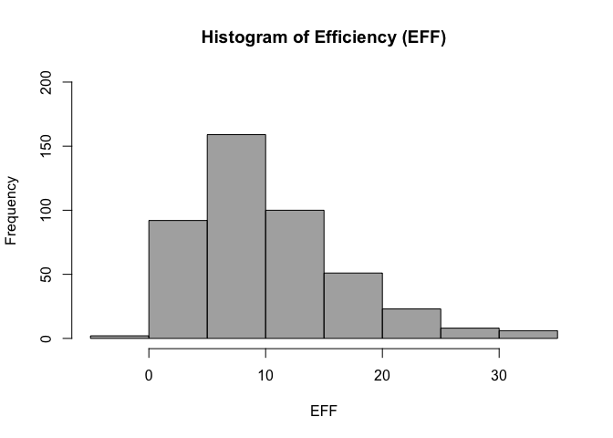
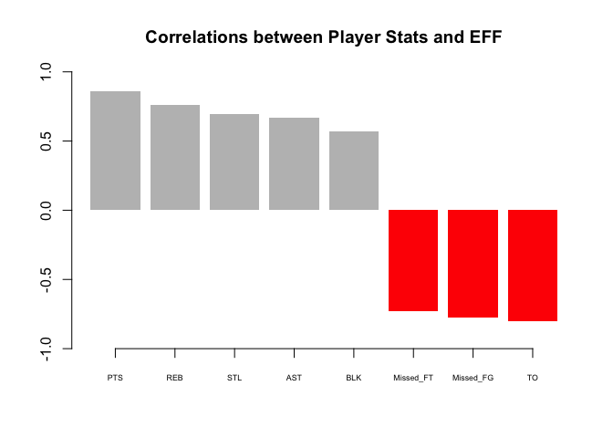
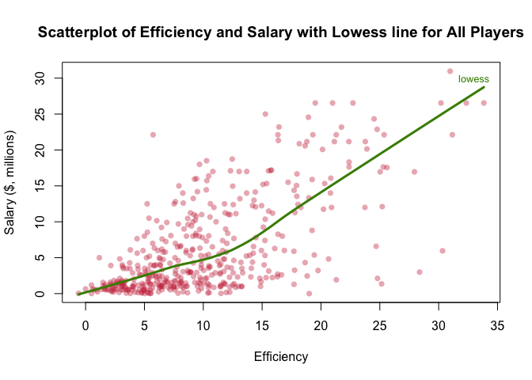
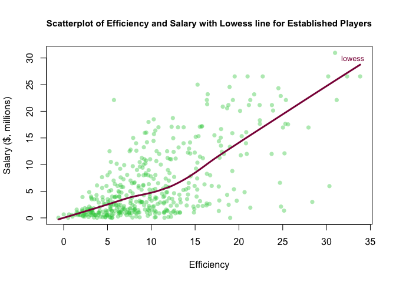

HW 02 - Basics of Data Frames
================

``` r
knitr::opts_chunk$set(echo = TRUE)
# add libraries
library(readr)
library(dplyr)
```

    ## Warning: package 'dplyr' was built under R version 3.4.2

    ## 
    ## Attaching package: 'dplyr'

    ## The following objects are masked from 'package:stats':
    ## 
    ##     filter, lag

    ## The following objects are masked from 'package:base':
    ## 
    ##     intersect, setdiff, setequal, union

Create a data dictionary
========================

The data dictionary is stored at the following link:

<https://github.com/earnestpointers/stat133-hws-fall17/blob/master/hw02/data/nba2017-player-statistics-dictionary.md>

Importing the data into R
=========================

``` r
# Use read.csv() to read csv into R and check with str()
base <- read.csv(file = "nba2017-player-statistics.csv",
                 colClasses = c('character', 
                                'character', 
                                'factor',
                                'character', 
                                'double', 
                                'integer',
                                'integer',
                                'integer',
                                'integer',
                                'integer',
                                'integer',
                                'integer',
                                'integer',
                                'integer',
                                'integer',
                                'integer',
                                'integer',
                                'integer',
                                'integer',
                                'integer',
                                'integer',
                                'integer',
                                'integer',
                                'integer'))
str(base)
```

    ## 'data.frame':    441 obs. of  24 variables:
    ##  $ Player      : chr  "Al Horford" "Amir Johnson" "Avery Bradley" "Demetrius Jackson" ...
    ##  $ Team        : chr  "BOS" "BOS" "BOS" "BOS" ...
    ##  $ Position    : Factor w/ 5 levels "C","PF","PG",..: 1 2 5 3 4 3 4 5 4 2 ...
    ##  $ Experience  : chr  "9" "11" "6" "R" ...
    ##  $ Salary      : num  26540100 12000000 8269663 1450000 1410598 ...
    ##  $ Rank        : int  4 6 5 15 11 1 3 13 8 10 ...
    ##  $ Age         : int  30 29 26 22 31 27 26 21 20 29 ...
    ##  $ GP          : int  68 80 55 5 47 76 72 29 78 78 ...
    ##  $ GS          : int  68 77 55 0 0 76 72 0 20 6 ...
    ##  $ MIN         : int  2193 1608 1835 17 538 2569 2335 220 1341 1232 ...
    ##  $ FGM         : int  379 213 359 3 95 682 333 25 192 114 ...
    ##  $ FGA         : int  801 370 775 4 232 1473 720 58 423 262 ...
    ##  $ Points3     : int  86 27 108 1 39 245 157 12 46 45 ...
    ##  $ Points3_atts: int  242 66 277 1 111 646 394 35 135 130 ...
    ##  $ Points2     : int  293 186 251 2 56 437 176 13 146 69 ...
    ##  $ Points2_atts: int  559 304 498 3 121 827 326 23 288 132 ...
    ##  $ FTM         : int  108 67 68 3 33 590 176 6 85 26 ...
    ##  $ FTA         : int  135 100 93 6 41 649 217 9 124 37 ...
    ##  $ OREB        : int  95 117 65 2 17 43 48 6 45 60 ...
    ##  $ DREB        : int  369 248 269 2 68 162 367 20 175 213 ...
    ##  $ AST         : int  337 140 121 3 33 449 155 4 64 71 ...
    ##  $ STL         : int  52 52 68 0 9 70 72 10 35 26 ...
    ##  $ BLK         : int  87 62 11 0 7 13 23 2 18 17 ...
    ##  $ TO          : int  116 77 88 0 25 210 79 4 68 39 ...

``` r
# Use read_csv() to read csv into R and check with str()
rdr <- read_csv(file = "nba2017-player-statistics.csv", 
                col_types = cols( Player = col_character(), 
                                  Team = col_character(), 
                                  Position = col_factor(levels = c('C',
                                                                   'PF',
                                                                   'PG',
                                                                   'SF',
                                                                   'SG')),
                                  Experience = col_character(), 
                                  Salary = col_double(), 
                                  Rank = col_integer(),
                                  Age = col_integer(),
                                  GP = col_integer(),
                                  GS = col_integer(),
                                  MIN = col_integer(),
                                  FGM = col_integer(),
                                  FGA = col_integer(),
                                  Points3 = col_integer(),
                                  Points3_atts = col_integer(),
                                  Points2 = col_integer(),
                                  Points2_atts = col_integer(),
                                  FTM = col_integer(),
                                  FTA = col_integer(),
                                  OREB = col_integer(),
                                  DREB = col_integer(),
                                  AST = col_integer(),
                                  STL = col_integer(),
                                  BLK = col_integer(),
                                  TO = col_integer()))
str(rdr)
```

    ## Classes 'tbl_df', 'tbl' and 'data.frame':    441 obs. of  24 variables:
    ##  $ Player      : chr  "Al Horford" "Amir Johnson" "Avery Bradley" "Demetrius Jackson" ...
    ##  $ Team        : chr  "BOS" "BOS" "BOS" "BOS" ...
    ##  $ Position    : Factor w/ 5 levels "C","PF","PG",..: 1 2 5 3 4 3 4 5 4 2 ...
    ##  $ Experience  : chr  "9" "11" "6" "R" ...
    ##  $ Salary      : num  26540100 12000000 8269663 1450000 1410598 ...
    ##  $ Rank        : int  4 6 5 15 11 1 3 13 8 10 ...
    ##  $ Age         : int  30 29 26 22 31 27 26 21 20 29 ...
    ##  $ GP          : int  68 80 55 5 47 76 72 29 78 78 ...
    ##  $ GS          : int  68 77 55 0 0 76 72 0 20 6 ...
    ##  $ MIN         : int  2193 1608 1835 17 538 2569 2335 220 1341 1232 ...
    ##  $ FGM         : int  379 213 359 3 95 682 333 25 192 114 ...
    ##  $ FGA         : int  801 370 775 4 232 1473 720 58 423 262 ...
    ##  $ Points3     : int  86 27 108 1 39 245 157 12 46 45 ...
    ##  $ Points3_atts: int  242 66 277 1 111 646 394 35 135 130 ...
    ##  $ Points2     : int  293 186 251 2 56 437 176 13 146 69 ...
    ##  $ Points2_atts: int  559 304 498 3 121 827 326 23 288 132 ...
    ##  $ FTM         : int  108 67 68 3 33 590 176 6 85 26 ...
    ##  $ FTA         : int  135 100 93 6 41 649 217 9 124 37 ...
    ##  $ OREB        : int  95 117 65 2 17 43 48 6 45 60 ...
    ##  $ DREB        : int  369 248 269 2 68 162 367 20 175 213 ...
    ##  $ AST         : int  337 140 121 3 33 449 155 4 64 71 ...
    ##  $ STL         : int  52 52 68 0 9 70 72 10 35 26 ...
    ##  $ BLK         : int  87 62 11 0 7 13 23 2 18 17 ...
    ##  $ TO          : int  116 77 88 0 25 210 79 4 68 39 ...
    ##  - attr(*, "spec")=List of 2
    ##   ..$ cols   :List of 24
    ##   .. ..$ Player      : list()
    ##   .. .. ..- attr(*, "class")= chr  "collector_character" "collector"
    ##   .. ..$ Team        : list()
    ##   .. .. ..- attr(*, "class")= chr  "collector_character" "collector"
    ##   .. ..$ Position    :List of 3
    ##   .. .. ..$ levels    : chr  "C" "PF" "PG" "SF" ...
    ##   .. .. ..$ ordered   : logi FALSE
    ##   .. .. ..$ include_na: logi FALSE
    ##   .. .. ..- attr(*, "class")= chr  "collector_factor" "collector"
    ##   .. ..$ Experience  : list()
    ##   .. .. ..- attr(*, "class")= chr  "collector_character" "collector"
    ##   .. ..$ Salary      : list()
    ##   .. .. ..- attr(*, "class")= chr  "collector_double" "collector"
    ##   .. ..$ Rank        : list()
    ##   .. .. ..- attr(*, "class")= chr  "collector_integer" "collector"
    ##   .. ..$ Age         : list()
    ##   .. .. ..- attr(*, "class")= chr  "collector_integer" "collector"
    ##   .. ..$ GP          : list()
    ##   .. .. ..- attr(*, "class")= chr  "collector_integer" "collector"
    ##   .. ..$ GS          : list()
    ##   .. .. ..- attr(*, "class")= chr  "collector_integer" "collector"
    ##   .. ..$ MIN         : list()
    ##   .. .. ..- attr(*, "class")= chr  "collector_integer" "collector"
    ##   .. ..$ FGM         : list()
    ##   .. .. ..- attr(*, "class")= chr  "collector_integer" "collector"
    ##   .. ..$ FGA         : list()
    ##   .. .. ..- attr(*, "class")= chr  "collector_integer" "collector"
    ##   .. ..$ Points3     : list()
    ##   .. .. ..- attr(*, "class")= chr  "collector_integer" "collector"
    ##   .. ..$ Points3_atts: list()
    ##   .. .. ..- attr(*, "class")= chr  "collector_integer" "collector"
    ##   .. ..$ Points2     : list()
    ##   .. .. ..- attr(*, "class")= chr  "collector_integer" "collector"
    ##   .. ..$ Points2_atts: list()
    ##   .. .. ..- attr(*, "class")= chr  "collector_integer" "collector"
    ##   .. ..$ FTM         : list()
    ##   .. .. ..- attr(*, "class")= chr  "collector_integer" "collector"
    ##   .. ..$ FTA         : list()
    ##   .. .. ..- attr(*, "class")= chr  "collector_integer" "collector"
    ##   .. ..$ OREB        : list()
    ##   .. .. ..- attr(*, "class")= chr  "collector_integer" "collector"
    ##   .. ..$ DREB        : list()
    ##   .. .. ..- attr(*, "class")= chr  "collector_integer" "collector"
    ##   .. ..$ AST         : list()
    ##   .. .. ..- attr(*, "class")= chr  "collector_integer" "collector"
    ##   .. ..$ STL         : list()
    ##   .. .. ..- attr(*, "class")= chr  "collector_integer" "collector"
    ##   .. ..$ BLK         : list()
    ##   .. .. ..- attr(*, "class")= chr  "collector_integer" "collector"
    ##   .. ..$ TO          : list()
    ##   .. .. ..- attr(*, "class")= chr  "collector_integer" "collector"
    ##   ..$ default: list()
    ##   .. ..- attr(*, "class")= chr  "collector_guess" "collector"
    ##   ..- attr(*, "class")= chr "col_spec"

Right after importing the data
==============================

``` r
# Replace occurences of "R" with 0 
base$Experience[base$Experience == "R"] = 0

# Convert Experience column from character to integer type
base$Experience <- as.integer(base$Experience)
str(base)
```

    ## 'data.frame':    441 obs. of  24 variables:
    ##  $ Player      : chr  "Al Horford" "Amir Johnson" "Avery Bradley" "Demetrius Jackson" ...
    ##  $ Team        : chr  "BOS" "BOS" "BOS" "BOS" ...
    ##  $ Position    : Factor w/ 5 levels "C","PF","PG",..: 1 2 5 3 4 3 4 5 4 2 ...
    ##  $ Experience  : int  9 11 6 0 9 5 4 2 0 6 ...
    ##  $ Salary      : num  26540100 12000000 8269663 1450000 1410598 ...
    ##  $ Rank        : int  4 6 5 15 11 1 3 13 8 10 ...
    ##  $ Age         : int  30 29 26 22 31 27 26 21 20 29 ...
    ##  $ GP          : int  68 80 55 5 47 76 72 29 78 78 ...
    ##  $ GS          : int  68 77 55 0 0 76 72 0 20 6 ...
    ##  $ MIN         : int  2193 1608 1835 17 538 2569 2335 220 1341 1232 ...
    ##  $ FGM         : int  379 213 359 3 95 682 333 25 192 114 ...
    ##  $ FGA         : int  801 370 775 4 232 1473 720 58 423 262 ...
    ##  $ Points3     : int  86 27 108 1 39 245 157 12 46 45 ...
    ##  $ Points3_atts: int  242 66 277 1 111 646 394 35 135 130 ...
    ##  $ Points2     : int  293 186 251 2 56 437 176 13 146 69 ...
    ##  $ Points2_atts: int  559 304 498 3 121 827 326 23 288 132 ...
    ##  $ FTM         : int  108 67 68 3 33 590 176 6 85 26 ...
    ##  $ FTA         : int  135 100 93 6 41 649 217 9 124 37 ...
    ##  $ OREB        : int  95 117 65 2 17 43 48 6 45 60 ...
    ##  $ DREB        : int  369 248 269 2 68 162 367 20 175 213 ...
    ##  $ AST         : int  337 140 121 3 33 449 155 4 64 71 ...
    ##  $ STL         : int  52 52 68 0 9 70 72 10 35 26 ...
    ##  $ BLK         : int  87 62 11 0 7 13 23 2 18 17 ...
    ##  $ TO          : int  116 77 88 0 25 210 79 4 68 39 ...

Performance of players
======================

``` r
# Add Missed_FG to base
base$Missed_FG <- (base$FGA - base$FGM)

# Add Missed_FT to base 
base$Missed_FT <- (base$FTA - base$FTM)

# Add PTS to base
base$PTS <- (3*base$Points3 + 2*base$Points2 + base$FTM)

# Add REB to base
base$REB <- (base$OREB + base$DREB)

# Add MPG to base
base$MPG <- (base$MIN - base$GP)

# Add EFF to base
base$EFF <- c(base$PTS + 
              base$REB +
              base$AST +
              base$STL +
              base$BLK -
              base$Missed_FG -
              base$Missed_FT -
              base$TO) / base$GP

# Summary statistics of EFF
summary(base$EFF)
```

    ##    Min. 1st Qu.  Median    Mean 3rd Qu.    Max. 
    ##  -0.600   5.452   9.090  10.137  13.247  33.840

``` r
# Histogram of EFF
hist(x = base$EFF,
     ylim = c(0, 200),
     xlab = 'EFF',
     ylab = 'Frequency',
     main = 'Histogram of Efficiency (EFF)',
     col = rgb(0.32, 0.32, 0.32, 0.50))
```



``` r
# Top 10 players by EFF
top.ten <- arrange(.data = base, desc(EFF)) %>% slice(1:10) %>% select(Player, Team, Salary, EFF)
top.ten
```

    ## # A tibble: 10 x 4
    ##                   Player  Team   Salary      EFF
    ##                    <chr> <chr>    <dbl>    <dbl>
    ##  1     Russell Westbrook   OKC 26540100 33.83951
    ##  2          James Harden   HOU 26540100 32.34568
    ##  3         Anthony Davis   NOP 22116750 31.16000
    ##  4          LeBron James   CLE 30963450 30.97297
    ##  5    Karl-Anthony Towns   MIN  5960160 30.32927
    ##  6          Kevin Durant   GSW 26540100 30.19355
    ##  7 Giannis Antetokounmpo   MIL  2995421 28.37500
    ##  8      DeMarcus Cousins   NOP 16957900 27.94118
    ##  9          Jimmy Butler   CHI 17552209 25.60526
    ## 10      Hassan Whiteside   MIA 22116750 25.36364

``` r
# Players with negative EFF
neg.eff <- arrange(.data = base) %>% filter(EFF < 0) %>% select(Player)
neg.eff
```

    ##            Player
    ## 1 Patricio Garino

``` r
# Compute correlation coefficient between EFF and all the variables in EFF formula
cor.pts <- cor(x = base$EFF,
               y = base$PTS)

cor.reb <- cor(x = base$EFF,
               y = base$REB)

cor.stl <- cor(x = base$EFF,
               y = base$STL)

cor.ast <- cor(x = base$EFF,
               y = base$AST)

cor.blk <- cor(x = base$EFF,
               y = base$BLK)

cor.missed_fg <- cor(x = base$EFF,
                     y = base$Missed_FG)

cor.missed_ft <- cor(x = base$EFF,
                     y = base$Missed_FT)

cor.to <- cor(x = base$EFF,
                     y = base$TO)

# Create data frame with all coefficients
all.cor <- data.frame(c(cor.pts, 
                        cor.reb, 
                        cor.stl, 
                        cor.ast, 
                        cor.blk, 
                        cor.missed_fg * -1, 
                        cor.missed_ft * -1, 
                        cor.to * -1))

# Name column 'coefficients'
attributes(all.cor)$names[1] <- 'coefficients'

# Sort coefficients by decreasing value
sorted.all.cor <- arrange(.data = all.cor,
                          desc(coefficients))

# Display coefficients
sorted.all.cor
```

    ##   coefficients
    ## 1    0.8588644
    ## 2    0.7634501
    ## 3    0.6957286
    ## 4    0.6689232
    ## 5    0.5679571
    ## 6   -0.7271456
    ## 7   -0.7722477
    ## 8   -0.8003289

``` r
# Create vector with variable names for x-axis of plot           
cnames = c('PTS', 
           'REB', 
           'STL', 
           'AST', 
           'BLK', 
           'Missed_FT', 
           'Missed_FG', 
           'TO')

# Create barplot of efficiency and salary
barplot(height = as.vector(sorted.all.cor[,1]),
        main = "Correlations between Player Stats and EFF",
        names.arg = cnames,
        axis.lty = 1,
        ylim = c(-1, 1),
        cex.names = 0.55,
        cex.axis = 1,
        border = 'NA',
        col = c('grey',
                'grey',
                'grey',
                'grey',
                'grey',
                'red',
                'red',
                'red'))
```



Efficiency and Salary
=====================

All Players
-----------

``` r
# Add scatterplot of efficiency and salary
plot(x = base$EFF,
     y = base$Salary/1000000,
     xlab = "Efficiency",
     ylab = "Salary ($, millions)",
     main = 'Scatterplot of Efficiency and Salary with Lowess line for All Players',
     pch = 16,
     col = rgb(0.8, 0.21, 0.3, 0.4))

# Add lowess line to plot
lines(lowess(x = base$EFF, y = base$Salary/1000000),
      lty = 1,
      lwd = 3,
      col = '#458b00')

# Add 'lowess' label to plot
text(x = 33, 
     y = 30, 
     labels = 'lowess', 
     col = '#458b00', 
     cex = 0.8)
```



``` r
# Compute correlation coefficient between efficiency and salary
cor.eff.sal <- cor(x = base$EFF,
                   y = base$Salary)
cor.eff.sal
```

    ## [1] 0.655624

### What can you say about the relationship between these two variables?

A correlation coefficient of 0.65 suggests the relationship between efficiency and salary is weak. In other words, you'd likely predict the wrong salary if you're given an efficiency value. It seems salary is dependent on other variables that aren't included in the efficiency equation.

Players with More Experience
----------------------------

``` r
players2 <- filter(base, MPG >= 20)

# Add scatterplot of efficiency and salary
plot(x =players2$EFF,
     y =players2$Salary/1000000,
     xlab = "Efficiency",
     ylab = "Salary ($, millions)",
     main = 'Scatterplot of Efficiency and Salary with Lowess line for Established Players',
     pch = 16,
     col = rgb(0.21, 0.8, 0.3, 0.4),
     cex.main = 0.95)

# Add lowess line to plot
lines(lowess(x = players2$EFF, 
             y = players2$Salary/1000000),
      lty = 1,
      lwd = 3,
      col = '#8b0046')

# Add 'lowess' label to plot
text(x = 33, 
     y = 30, 
     labels = 'lowess', 
     col = '#8b0046', 
     cex = 0.8)
```



``` r
# Compute correlation coefficient between efficiency and salary
cor.eff.sal <- cor(x = players2$EFF,
                   y = players2$Salary)
cor.eff.sal
```

    ## [1] 0.6537226

### What can you say about these two variables for the established players?

The correlation coefficient of efficiency and salary for established players is 0.63. This coefficient is 0.002 lower than the coefficient for all players. The correlation is even weaker for established players. Salary may depend on other variables that aren't included in the efficiency equation. All the points that aren't close to the lowess line tell us that there is variation on how much players earn per efficiency value. There is a lot of variation in salary for players who have efficiency values between 5 and 14. Players who have efficiency values above 14 earn more per efficiency value on average.

Comments and Reflection
=======================

**1. What was hard?**

There is a subtlety to data frames that I sometimes trip over. This homework helped find that subtlety.

**2. What was easy?**

The plots were easy because we learned them on the last homework.

**3. Did you need help?**

Yes. The homework instructions aren't clear when it tells us to add columns for Missed\_FG, Missed\_FT, MPG, etc. It should be explicit that we are supposed to calculate them with the data in the table.

**4. How much time did it take?**

4 hours.

**5. What was the most time consuming?**

Formatting the code.

**6. Was there anything that you did not understand?**

I had to think about why 3 correlation coefficients are supposed to be negative.

**7. Was there anything frustrating?**

No.

**8. Was there anything exciting?**

Yes. We are using larger data sets!
