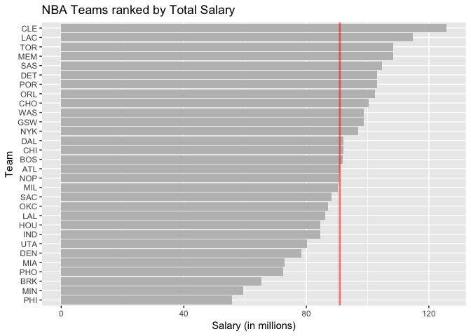
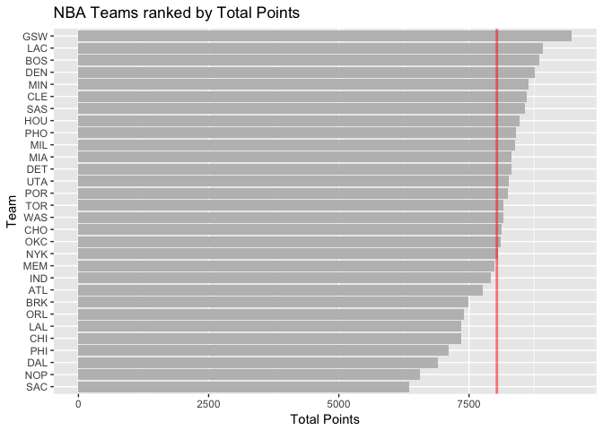
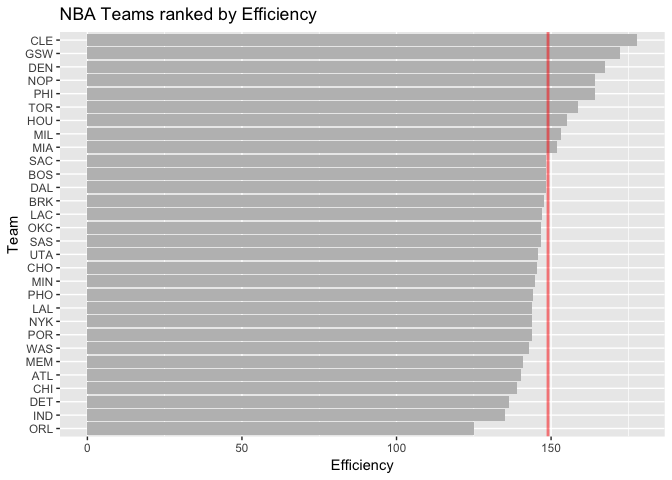
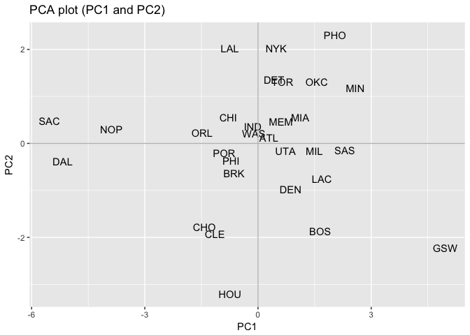
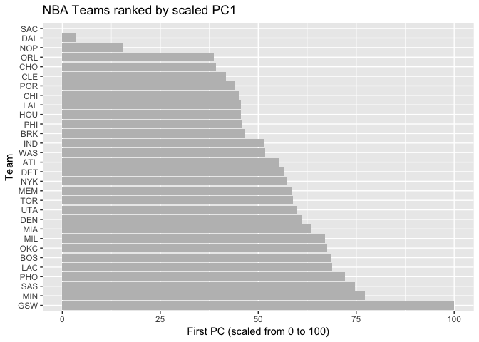

HW03 - Ranking NBA Teams
================
Bryant Luong
10/13/2017

Setup
-----

``` r
knitr::opts_chunk$set(echo = TRUE)
knitr::read_chunk(path = '../code/make-teams-table.R')
```

``` r
# load packages
library(dplyr)
```

    ## Warning: package 'dplyr' was built under R version 3.4.2

    ## 
    ## Attaching package: 'dplyr'

    ## The following objects are masked from 'package:stats':
    ## 
    ##     filter, lag

    ## The following objects are masked from 'package:base':
    ## 
    ##     intersect, setdiff, setequal, union

``` r
library(readr)
library(ggplot2)
```

Data Preparation
----------------

``` r
# read tables into R and store into 2 new objects
NBAstats <- read_csv(file = "../data/nba2017-stats.csv")
```

    ## Parsed with column specification:
    ## cols(
    ##   .default = col_integer(),
    ##   player = col_character(),
    ##   field_goals_perc = col_double(),
    ##   points3_perc = col_double(),
    ##   points2_perc = col_double(),
    ##   points1_perc = col_double()
    ## )

    ## See spec(...) for full column specifications.

``` r
NBAroster <- read_csv(file = "../data/nba2017-roster.csv")
```

    ## Parsed with column specification:
    ## cols(
    ##   player = col_character(),
    ##   team = col_character(),
    ##   position = col_character(),
    ##   height = col_integer(),
    ##   weight = col_integer(),
    ##   age = col_integer(),
    ##   experience = col_integer(),
    ##   salary = col_double()
    ## )

``` r
# add 5 new variables to NBAstats 
# missed_fg
NBAstats <- mutate(NBAstats, 
                   missed_fg = field_goals_atts - field_goals_made)
# missed_ft
NBAstats <- mutate(NBAstats,
                    missed_ft = points1_atts - points1_made)
# points
NBAstats <- mutate(NBAstats,
                   points = points1_made + 2*points2_made + 3*points3_made)
# rebounds
NBAstats <- mutate(NBAstats,
                   rebounds = off_rebounds + def_rebounds)
# efficiency
NBAstats <- mutate(NBAstats,
                   efficiency = (points + rebounds + assists + steals + 
                                   blocks -  missed_fg - missed_ft 
                                 - turnovers)/games_played)
```

``` r
# merge the data frames NBAstats and NBAroster with merge()
m <- merge(NBAroster, NBAstats)

# create data frame 'teams'
teams <- m %>% group_by(team) %>% summarise(experience = round(sum(experience), digits = 2),
                                            salary = round(sum(salary)/1000000, digits = 2),
                                            points3 = sum(points3_made),
                                            points2 = sum(points2_made),
                                            free_throws = sum(points1_made),
                                            points = sum(points1_made + 2*points2_made 
                                                         + 3*points3_made),
                                            off_rebounds = sum(off_rebounds),
                                            def_rebounds = sum(def_rebounds),
                                            assists = sum(assists),
                                            steals = sum(steals),
                                            blocks = sum(blocks),
                                            turnovers = sum(turnovers),
                                            fouls = sum(fouls),
                                            efficiency = sum(efficiency))
```

Basic Ranking: By Salary
------------------------

``` r
# rank team by salary 
teamsBySalary.df <- arrange(teams, salary)

# make 'teamBySalary.df$team' an ordered factor
teamsBySalary.df$team <- factor(teamsBySalary.df$team, levels = teamsBySalary.df$team)

# create horizontal barchart with vertical red line representing average team salary
p <- ggplot(data = teamsBySalary.df,
            mapping = aes(team, salary))
       
pbl <- p + geom_bar(stat = 'identity', 
                    fill = "grey") + coord_flip() + labs(x = 'Team',
                                                         y = 'Salary (in millions)',
                                                         title = 'NBA Teams ranked by Total Salary')

pbl + geom_hline(aes(yintercept=mean(teamsBySalary.df$salary)), 
                 color = rgb(1, 0, 0, 0.5), 
                 lty = 1, lwd = 1)
```



### Provide a concise description of this basic ranking.

The mean team salary was approximately $91 million and 6 teams were very close to the mean. The standard deviation was $15.76 million.

The Cleveland Cavaliers had the largest team salary of $125.79 million, which is 2 SDs above the mean. The Philadelphia 76ers had the smallest team salary of $55.78 million, which is 2 SDs below the mean.

The team salaries change the fastest around $60 to $80 million. After $80 million a year, the increase in team salary between teams is smaller. However, the biggest difference between 2 neighboring teams on the barplot is between the highest and second-highest team salaries. The Cavaliers spend almost $40 million more than the Clippers.

Basic Ranking: By Points
------------------------

``` r
# rank team by total points
teamsByPoints.df <- arrange(teams, points)

# make 'teamByPoints.df$team' an ordered factor
teamsByPoints.df$team <- factor(teamsByPoints.df$team, levels = teamsByPoints.df$team)

# create horizontal barchart with vertical red line representing average team total points
p <- ggplot(data = teamsByPoints.df,
            mapping = aes(team, points))

pbl <- p + geom_bar(stat = 'identity', 
                    fill = "grey") + coord_flip() + labs(x = 'Team', 
                                                         y = 'Total Points',
                                                         title = 'NBA Teams ranked by Total Points')


pbl + geom_hline(aes(yintercept=mean(teamsByPoints.df$points)), 
                 color = rgb(1, 0, 0, 0.5), 
                 lty = 1, lwd = 1)
```



### Provide a concise description of this basic ranking.

In the 2017 season, the Sacramento Kings scored the least points and the Golden State Warriors scored the most points. The Warriors scored 9,473 points and the Kings scored only 6,348, so the Warriors scored almost 50% more points. The Warriors even scored 562 more points than the Clippers, which is the biggest difference between 2 neighboring teams on the barplot.

The mean number of points was 8,035 and the standard deviation was 710 points. The Warriors are 2 SDs above the mean.

The Clippers is the only team that had the same ranking by salary and by points. By these two metrics, they're 2nd in the NBA.

Basic Ranking: By Efficiency
----------------------------

``` r
# rank team by efficiency
teamsByEff.df <- arrange(teams, efficiency)

# make 'teamByEff.df$team' an ordered factor
teamsByEff.df$team <- factor(teamsByEff.df$team, 
                             levels = teamsByEff.df$team)

# create horizontal barchart with vertical red line representing average team total points
p <- ggplot(data = teamsByEff.df,
            mapping = aes(team, efficiency))

pbl <- p + geom_bar(stat = 'identity', 
                    fill = "grey") + coord_flip() + labs(x = 'Team',
                                                         y = 'Efficiency',
                                                         title = 'NBA Teams ranked by Efficiency')

pbl + geom_hline(aes(yintercept=mean(teamsByEff.df$efficiency)), 
                 color = rgb(1, 0, 0, 0.5), 
                 lty = 1, lwd = 1)
```



### Provide concise descriptions of the basic rankings.

Comparing the rankings by salary and by efficiency, 2 teams have the same ranking, the Lakers and Cavaliers. The Lakers are ranked \#20 and the Cavaliers are ranked \#1.

Comparing the rankings by points and by efficiency, 0 teams have the same ranking.

The mean efficiency is 149 and the standard deviation is 11.28. The Cavaliers have the maximum efficiency of 177.86 and the Magics have the minimum efficiency of 125.14. 22 teams are within 1 SD and 5 teams are above 1 SD.

Principal Components Analysis
-----------------------------

``` r
# create data frame for PCA
pca.df <- teams %>% select(team, 
                           points3, 
                           points2, 
                           free_throws, 
                           off_rebounds, 
                           def_rebounds, 
                           assists, 
                           steals, 
                           blocks, 
                           turnovers, 
                           fouls)

# compute PCA
pcs <- prcomp(pca.df[-1], scale. = TRUE)

# create data frames for eigenvalues, their proportions, and cumulative proportions
eigs <- round(pcs$sdev^2, digits = 4)
prop <- round(pcs$sdev^2 / sum(pcs$sdev^2), digits = 4)
cumprop <- cumsum(prop)

# create data frame with all 3 metrics
eigs.df <- data.frame(eigs, prop, cumprop)
eigs.df
```

    ##      eigs   prop cumprop
    ## 1  4.6959 0.4696  0.4696
    ## 2  1.7020 0.1702  0.6398
    ## 3  0.9795 0.0980  0.7378
    ## 4  0.7717 0.0772  0.8150
    ## 5  0.5341 0.0534  0.8684
    ## 6  0.4780 0.0478  0.9162
    ## 7  0.3822 0.0382  0.9544
    ## 8  0.2603 0.0260  0.9804
    ## 9  0.1336 0.0134  0.9938
    ## 10 0.0627 0.0063  1.0001

``` r
# create data frame that contains only PC1 and PC2 values of each team
pc1pc2 <- data.frame('PC1' = pcs$x[,1], 
                     'PC2' = pcs$x[,2],
                     'team' = teams$team)

# create scatterplot of teams using PC1 and PC2
ggplot(data = pc1pc2, 
       aes(x = PC1, y = PC2, label = team)) + geom_text() + geom_hline(yintercept = 0, color = 'grey') + geom_vline(xintercept = 0, color = 'grey') + labs(title = 'PCA plot (PC1 and PC2)')
```



### Interpret the scatterplot.

The purpose of PCA is to find the basis that captures the most variation in the data and to reduce the dimensions of data. PCA will guide us to the teams that are most different from other teams by giving us principal components (PC). Principal components can be understood as summaries of all dimensions of the data. By plotting PC1 and PC2 together, we are able to **see** the performances of teams because our data has the ten most critical metrics of game play: 3-pointers, 2-pointers, free throws, rebounds, assists, steals, turnovers, blocks, and fouls.

The teams that are inside -3 and 3 on the PC1 axis have performed similarly. The unusual teams are GSW, NOP, DAL, and SAC. To further understand why these teams are outliers, we first look at the weights for PC1 to understand how each game play statistic contributes to the PC score. We know the PC scores are a linear combination of the 10 game play metrics. The weights for PC1 are:

| variable      | weight |
|---------------|--------|
| points3       | 0.1122 |
| points2       | 0.3602 |
| free\_throws  | 0.3228 |
| off\_rebounds | 0.3029 |
| def\_rebounds | 0.3719 |
| assists       | 0.3125 |
| steals        | 0.3447 |
| blocks        | 0.3162 |
| turnovers     | 0.3354 |
| fouls         | 0.3073 |

The game play statistics that contribute most to the PC score are defensive rebounds, 2-pointers, and turnovers. Let's check these statistics for GSW, NOP, DAL, and SAC.

``` r
pca.df %>% group_by(team) %>% arrange(def_rebounds)
```

    ## # A tibble: 30 x 11
    ## # Groups:   team [30]
    ##     team points3 points2 free_throws off_rebounds def_rebounds assists
    ##    <chr>   <int>   <int>       <int>        <int>        <int>   <int>
    ##  1   SAC     558    1838         998          524         1878    1394
    ##  2   DAL     754    1803        1042          534         2109    1291
    ##  3   NOP     513    1952        1120          580         2244    1523
    ##  4   PHI     690    1917        1212          673         2282    1788
    ##  5   WAS     671    2417        1316          748         2393    1861
    ##  6   CHI     565    2162        1330          865         2416    1746
    ##  7   HOU    1141    1769        1508          766         2429    1906
    ##  8   ORL     614    2168        1230          699         2435    1744
    ##  9   IND     641    2331        1333          679         2436    1713
    ## 10   POR     852    2156        1386          710         2437    1519
    ## # ... with 20 more rows, and 4 more variables: steals <int>, blocks <int>,
    ## #   turnovers <int>, fouls <int>

``` r
pca.df %>% group_by(team) %>% arrange(desc(def_rebounds))
```

    ## # A tibble: 30 x 11
    ## # Groups:   team [30]
    ##     team points3 points2 free_throws off_rebounds def_rebounds assists
    ##    <chr>   <int>   <int>       <int>        <int>        <int>   <int>
    ##  1   GSW     982    2540        1447          759         2854    2475
    ##  2   DET     631    2638        1140          908         2838    1731
    ##  3   LAC     841    2401        1586          740         2790    1848
    ##  4   UTA     791    2242        1401          771         2774    1651
    ##  5   SAS     743    2459        1431          821         2768    1926
    ##  6   BOS     985    2183        1536          744         2698    2069
    ##  7   MIA     799    2349        1217          857         2649    1728
    ##  8   DEN     868    2347        1471          867         2646    2009
    ##  9   CLE    1012    2107        1355          727         2639    1760
    ## 10   CHO     808    2102        1499          634         2636    1805
    ## # ... with 20 more rows, and 4 more variables: steals <int>, blocks <int>,
    ## #   turnovers <int>, fouls <int>

The data above tells us that SAC, DAL, and NOP are the 3 teams with the least defensive rebounds and GSW had the most defensive rebounds. Let's do the same search for 2-pointers and turnovers.

``` r
pca.df %>% group_by(team) %>% arrange(points2)
```

    ## # A tibble: 30 x 11
    ## # Groups:   team [30]
    ##     team points3 points2 free_throws off_rebounds def_rebounds assists
    ##    <chr>   <int>   <int>       <int>        <int>        <int>   <int>
    ##  1   HOU    1141    1769        1508          766         2429    1906
    ##  2   DAL     754    1803        1042          534         2109    1291
    ##  3   SAC     558    1838         998          524         1878    1394
    ##  4   PHI     690    1917        1212          673         2282    1788
    ##  5   BRK     738    1950        1381          608         2546    1593
    ##  6   NOP     513    1952        1120          580         2244    1523
    ##  7   CHO     808    2102        1499          634         2636    1805
    ##  8   CLE    1012    2107        1355          727         2639    1760
    ##  9   MEM     750    2140        1465          866         2534    1669
    ## 10   POR     852    2156        1386          710         2437    1519
    ## # ... with 20 more rows, and 4 more variables: steals <int>, blocks <int>,
    ## #   turnovers <int>, fouls <int>

``` r
pca.df %>% group_by(team) %>% arrange(desc(points2))
```

    ## # A tibble: 30 x 11
    ## # Groups:   team [30]
    ##     team points3 points2 free_throws off_rebounds def_rebounds assists
    ##    <chr>   <int>   <int>       <int>        <int>        <int>   <int>
    ##  1   DET     631    2638        1140          908         2838    1731
    ##  2   MIN     601    2623        1585          938         2530    1934
    ##  3   PHO     564    2551        1605          882         2456    1530
    ##  4   GSW     982    2540        1447          759         2854    2475
    ##  5   SAS     743    2459        1431          821         2768    1926
    ##  6   NYK     636    2445        1262          961         2591    1499
    ##  7   MIL     718    2424        1388          700         2541    1953
    ##  8   WAS     671    2417        1316          748         2393    1861
    ##  9   LAC     841    2401        1586          740         2790    1848
    ## 10   OKC     611    2380        1511          936         2628    1610
    ## # ... with 20 more rows, and 4 more variables: steals <int>, blocks <int>,
    ## #   turnovers <int>, fouls <int>

The data above tells us that SAC, DAL, and NOP are among the teams that scored the fewest 2-pointers and GSW is in the top 5.

``` r
pca.df %>% group_by(team) %>% arrange(turnovers)
```

    ## # A tibble: 30 x 11
    ## # Groups:   team [30]
    ##     team points3 points2 free_throws off_rebounds def_rebounds assists
    ##    <chr>   <int>   <int>       <int>        <int>        <int>   <int>
    ##  1   DAL     754    1803        1042          534         2109    1291
    ##  2   NOP     513    1952        1120          580         2244    1523
    ##  3   CHO     808    2102        1499          634         2636    1805
    ##  4   SAC     558    1838         998          524         1878    1394
    ##  5   DET     631    2638        1140          908         2838    1731
    ##  6   TOR     626    2359        1570          848         2533    1469
    ##  7   CHI     565    2162        1330          865         2416    1746
    ##  8   MEM     750    2140        1465          866         2534    1669
    ##  9   NYK     636    2445        1262          961         2591    1499
    ## 10   ORL     614    2168        1230          699         2435    1744
    ## # ... with 20 more rows, and 4 more variables: steals <int>, blocks <int>,
    ## #   turnovers <int>, fouls <int>

``` r
pca.df %>% group_by(team) %>% arrange(desc(turnovers))
```

    ## # A tibble: 30 x 11
    ## # Groups:   team [30]
    ##     team points3 points2 free_throws off_rebounds def_rebounds assists
    ##    <chr>   <int>   <int>       <int>        <int>        <int>   <int>
    ##  1   PHI     690    1917        1212          673         2282    1788
    ##  2   GSW     982    2540        1447          759         2854    2475
    ##  3   PHO     564    2551        1605          882         2456    1530
    ##  4   BRK     738    1950        1381          608         2546    1593
    ##  5   ATL     626    2254        1373          807         2537    1784
    ##  6   OKC     611    2380        1511          936         2628    1610
    ##  7   DEN     868    2347        1471          867         2646    2009
    ##  8   MIN     601    2623        1585          938         2530    1934
    ##  9   MIL     718    2424        1388          700         2541    1953
    ## 10   UTA     791    2242        1401          771         2774    1651
    ## # ... with 20 more rows, and 4 more variables: steals <int>, blocks <int>,
    ## #   turnovers <int>, fouls <int>

The data above tells us that DAL, NOP, and SAC are in the top 5 for fewest turnovers while GSW is in the top 3 for the most turnovers.

We can do a similar analysis for PC2 for teams greater than 2 and less than -2. These teams are PHO, HOU, and GSW.

Index based on PC1
------------------

``` r
# create index based on PC1
s1 <- data.frame('s1' = 100 * (pcs$x[,1] - min(pcs$x[,1])) / (max(pcs$x[,1]) - min(pcs$x[,1])),
                 'team' = teams$team)

# rank team by scaled PC1
s1 <- arrange(s1, desc(s1))

# make 'teams' an ordered factor
s1$team <- factor(s1$team, levels = s1$team)

# create horizontal bar chart of scaled PC1 to visualize ranking  
p <- ggplot(data = s1,
            mapping = aes(team, s1))
p + geom_bar(stat = 'identity', 
             fill = "grey") + coord_flip() + labs(x = 'Team',
                                                  y = 'First PC (scaled from 0 to 100)',
                                                  title = 'NBA Teams ranked by scaled PC1')
```



### Provide a brief description of the PC1 index to rank the teams.

The PC1 index uses the first principal component to create a 0-100 scale and each team is ranked relative to the minimum first principal component. The width of the scale is determined by the minimum and maximum principal component score of the teams. Because the first principal component score of each team is calculated using the same set of weights, the variation we see is from the game play statistics. As we can see in the table above, the principal component weights are all between 0.3 and 0.4 so this gives us confidence that there isn't too much bias towards 1 game play statistics. In fact, the GSW have the best 3-point statistics but that statistic only gets weighted by 0.11. With this mind, they still come up at the top!

Comments and Reflections
------------------------

**1. Was this your first time working on a project with such file structure? If yes, how do you feel about it?**

It was my first time and it felt very organized. It made this mini project easier to manage.

**2. Was this your first time using relative paths? If yes, can you tell why they are important for reproducibility purposes?**

It was my fist time using relative paths and I now understand its usefulness. Relative paths ensure files in the scripts can be located and used.

**3. Was this your first time using R script?**

No, we used it in lab!

**4. What was hard, even though you saw them in class/lab?**

There are ggplot functions that are not intuitive to me.

**5. What was easy?**

The first parts of the mini project were easy.

**6. Did anyone help you complete this assignment?**

No.

**7. How much time did it take to complete this HW?**

8 hours.

**8. What was the most time consuming part?**

Figuring out why my barplot was being automatically sorted alphabetically.

**9. Was there anything interesting?**

PCA is very cool and useful.
