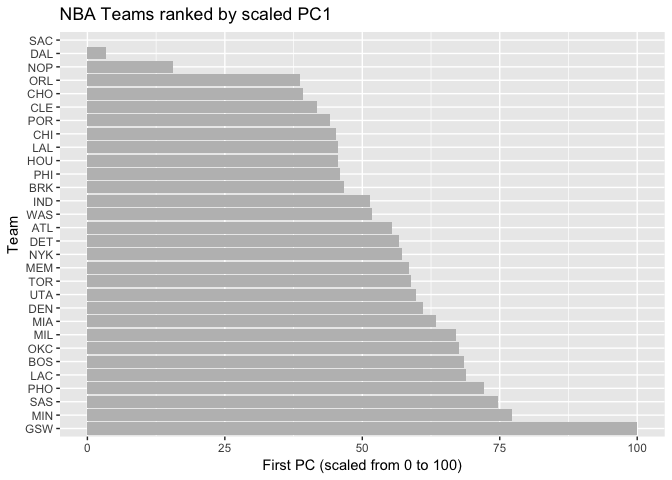

HW03 - Ranking NBA Teams
================
Bryant Luong
10/13/2017

``` r
knitr::opts_chunk$set(echo = TRUE)
knitr::read_chunk(path = '../code/make-teams-table.R')
```

``` r
# load packages
library(dplyr)
```

    ## Warning: package 'dplyr' was built under R version 3.4.2

    ## 
    ## Attaching package: 'dplyr'

    ## The following objects are masked from 'package:stats':
    ## 
    ##     filter, lag

    ## The following objects are masked from 'package:base':
    ## 
    ##     intersect, setdiff, setequal, union

``` r
library(readr)
library(ggplot2)

# read tables into R and store into 2 new objects
NBAstats <- read_csv(file = "../data/nba2017-stats.csv")
```

    ## Parsed with column specification:
    ## cols(
    ##   .default = col_integer(),
    ##   player = col_character(),
    ##   field_goals_perc = col_double(),
    ##   points3_perc = col_double(),
    ##   points2_perc = col_double(),
    ##   points1_perc = col_double()
    ## )

    ## See spec(...) for full column specifications.

``` r
NBAroster <- read_csv(file = "../data/nba2017-roster.csv")
```

    ## Parsed with column specification:
    ## cols(
    ##   player = col_character(),
    ##   team = col_character(),
    ##   position = col_character(),
    ##   height = col_integer(),
    ##   weight = col_integer(),
    ##   age = col_integer(),
    ##   experience = col_integer(),
    ##   salary = col_double()
    ## )

``` r
# add 5 new variables to NBAstats 
# missed_fg
NBAstats <- mutate(NBAstats, 
                   missed_fg = field_goals_atts - field_goals_made)
# missed_ft
NBAstats <- mutate(NBAstats,
                    missed_ft = points1_atts - points1_made)
# points
NBAstats <- mutate(NBAstats,
                   points = points1_made + 2*points2_made + 3*points3_made)
# rebounds
NBAstats <- mutate(NBAstats,
                   rebounds = off_rebounds + def_rebounds)
# efficiency
NBAstats <- mutate(NBAstats,
                   efficiency = (points + rebounds + assists + steals + 
                                   blocks -  missed_fg - missed_ft 
                                 - turnovers)/games_played)
```

``` r
# merge the data frames NBAstats and NBAroster with merge()
m <- merge(NBAroster, NBAstats)

# create data frame 'teams'
teams <- m %>% group_by(team) %>% summarise(experience = round(sum(experience), digits = 2),
                                            salary = round(sum(salary)/1000000, digits = 2),
                                            points3 = sum(points3_made),
                                            points2 = sum(points2_made),
                                            free_throws = sum(points1_made),
                                            points = sum(points1_made + 2*points2_made 
                                                         + 3*points3_made),
                                            off_rebounds = sum(off_rebounds),
                                            def_rebounds = sum(def_rebounds),
                                            assists = sum(assists),
                                            steals = sum(steals),
                                            blocks = sum(blocks),
                                            turnovers = sum(turnovers),
                                            fouls = sum(fouls),
                                            efficiency = sum(efficiency))
```

``` r
# rank team by salary 
teamsBySalary.df <- arrange(teams, salary)

# make 'teamBySalary.df$team' an ordered factor
teamsBySalary.df$team <- factor(teamsBySalary.df$team, levels = teamsBySalary.df$team)

# create horizontal barchart with vertical red line representing average team salary
p <- ggplot(data = teamsBySalary.df,
            mapping = aes(team, salary))
       
pbl <- p + geom_bar(stat = 'identity', 
                    fill = "grey") + coord_flip() + labs(x = 'Team',
                                                         y = 'Salary (in millions)',
                                                         title = 'NBA Teams ranked by Total Salary')

pbl + geom_hline(aes(yintercept=mean(teamsBySalary.df$salary)), 
                 color = rgb(1, 0, 0, 0.5), 
                 lty = 1, lwd = 1)
```


``` r
# rank team by total points
teamsByPoints.df <- arrange(teams, points)

# make 'teamByPoints.df$team' an ordered factor
teamsByPoints.df$team <- factor(teamsByPoints.df$team, levels = teamsByPoints.df$team)

# create horizontal barchart with vertical red line representing average team total points
p <- ggplot(data = teamsByPoints.df,
            mapping = aes(team, points))

pbl <- p + geom_bar(stat = 'identity', 
                    fill = "grey") + coord_flip() + labs(x = 'Team', 
                                                         y = 'Total Points',
                                                         title = 'NBA Teams ranked by Total Points')


pbl + geom_hline(aes(yintercept=mean(teamsByPoints.df$points)), 
                 color = rgb(1, 0, 0, 0.5), 
                 lty = 1, lwd = 1)
```


``` r
# rank team by efficiency
teamsByEff.df <- arrange(teams, efficiency)

# make 'teamByEff.df$team' an ordered factor
teamsByEff.df$team <- factor(teamsByEff.df$team, 
                             levels = teamsByEff.df$team)

# create horizontal barchart with vertical red line representing average team total points
p <- ggplot(data = teamsByEff.df,
            mapping = aes(team, efficiency))

pbl <- p + geom_bar(stat = 'identity', 
                    fill = "grey") + coord_flip() + labs(x = 'Team',
                                                         y = 'Efficiency',
                                                         title = 'NBA Teams ranked by Efficiency')

pbl + geom_hline(aes(yintercept=mean(teamsByEff.df$efficiency)), 
                 color = rgb(1, 0, 0, 0.5), 
                 lty = 1, lwd = 1)
```


``` r
pca.df <- teams %>% select(team, 
                           points3, 
                           points2, 
                           free_throws, 
                           off_rebounds, 
                           def_rebounds, 
                           assists, 
                           steals, 
                           blocks, 
                           turnovers, 
                           fouls)

pcs <- prcomp(pca.df[-1], scale. = TRUE)

eigs <- round(pcs$sdev^2, digits = 4)
prop <- round(pcs$sdev^2 / sum(pcs$sdev^2), digits = 4)
cumprop <- cumsum(prop)

eigs.df <- data.frame(eigs, prop, cumprop)

pc1pc2 <- data.frame('PC1' = pcs$x[,1], 
                     'PC2' = pcs$x[,2],
                     'team' = teams$team)

ggplot(data = pc1pc2, 
       aes(x = PC1, y = PC2, label = team)) + geom_text() + geom_hline(yintercept = 0, color = 'grey') + geom_vline(xintercept = 0, color = 'grey') + labs(title = 'PCA plot (PC1 and PC2)')
```


``` r
s1 <- data.frame('s1' = 100 * (pcs$x[,1] - min(pcs$x[,1])) / (max(pcs$x[,1]) - min(pcs$x[,1])),
                 'team' = teams$team)

# rank team by scaled PC1
s1 <- arrange(s1, desc(s1))

# make ordered factor of teams
s1$team <- factor(s1$team, levels = s1$team)

# create horizontal bar chart of scaled PC1 to visualize ranking  
p <- ggplot(data = s1,
            mapping = aes(team, s1))
p + geom_bar(stat = 'identity', 
             fill = "grey") + coord_flip() + labs(x = 'Team',
                                                  y = 'First PC (scaled from 0 to 100)',
                                                  title = 'NBA Teams ranked by scaled PC1')
```



Comments and Reflections
------------------------

**1. Was this your first time working on a project with such file structure? If yes, how do you feel about it?**

It was my first time and it felt very organized. It made this mini project easier to manage.

**2. Was this your first time using relative paths? If yes, can you tell why they are important for reproducibility purposes?**

It was my fist time using relative paths and I now understand its usefulness. Relative paths ensure files in the scripts can be located and used.

**3. Was this your first time using R script?**

No, we used it in lab!

**4. What was hard, even though you saw them in class/lab?**

There are ggplot functions that are not intuitive to me.

**5. What was easy?**

The first parts of the mini project were easy.

**6. Did anyone help you complete this assignment?**

No.

**7. How much time did it take to complete this HW?**

8 hours.

**8. What was the most time consuming part?**

Figuring out why my barplot was being automatically sorted alphabetically.

**9. Was there anything interesting?**

PCA is very cool and useful.
