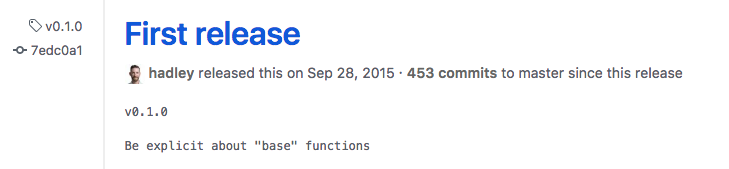
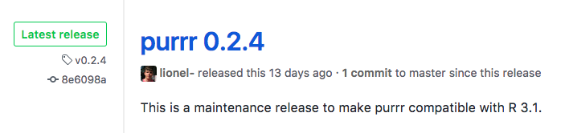

Post 1 Purrr - The Youngest Tidyverse Package
================
Bryant Luong
October 31, 2017

Introduction
============

In our labs and homeworks, we've learned and used the `dplyr`, `ggplot2`, and `readr` packages in the tidyverse. These packages are mature and very powerful but there is a very young package in the tidyverse. It is called `purrr` and its authors are Lionel Henry and Hadley Wickam.  

It was first released in 2015. 

The latest release was 13 days ago, on October 18, 2017.

In this post, you will see how `purrr` is used and you will see why `purrr` is awesome and powerful.

Let's go!

Fundamentals
============

The goal of `purrr` is easy manipulation of data in lists. While `dplyr` makes it easy to `select`, `filter`, `mutate`, `arrange`, and `summarize` lists, `purrr` makes it easy to ***change*** the data in the list. `dplyr` only allows you to look at and choose the data that you want. `purrr` allows (enables) you to touch and alter the data. Let's check out an example.

First, I make a simple vector.

``` r
cool.animals <- c("cat", "kitten", "dog", "puppy", "zebra", "sloth", "calf", "piglet")
```

Then, I want to know the length of each element in `cool.animals`. One way to find the length is to walk through `cool.animals` in a `for` loop.

``` r
for (i in cool.animals){
  x <- i
  print(nchar(x))
}
```

    ## [1] 3
    ## [1] 6
    ## [1] 3
    ## [1] 5
    ## [1] 5
    ## [1] 5
    ## [1] 4
    ## [1] 6

How do we do this with the functions in `purrr`? Let's see!

``` r
# install.packages('purrr')
library(purrr)
```

    ## Warning: package 'purrr' was built under R version 3.4.2

``` r
cool.animals.len <- map(cool.animals, nchar)
cool.animals.len
```

    ## [[1]]
    ## [1] 3
    ## 
    ## [[2]]
    ## [1] 6
    ## 
    ## [[3]]
    ## [1] 3
    ## 
    ## [[4]]
    ## [1] 5
    ## 
    ## [[5]]
    ## [1] 5
    ## 
    ## [[6]]
    ## [1] 5
    ## 
    ## [[7]]
    ## [1] 4
    ## 
    ## [[8]]
    ## [1] 6

I found the same answer to my question with 1 line of code and *you* just met the most used and most important function of `purrr`, <br /> **the `map` function**!

`map`
=====

Like `select`, `filter`, `mutate`, `arrange`, and `summarize` of `dplyr`, `map` is just another function in the `purrr` package.

What does `map` do?
-------------------

`map` applies a function to each element of the input. Now you have another way to use data! More importantly, notice it is much less code to write, which means less code to debug when things aren't right. And less code means you have less code to review when you come back to the code after a few months. These are the merits of succinct code.

What does `map` return?
-----------------------

`map` returns a list that is the same length as the input. Always.

``` r
x <- c("three", "body", "problem")
y <- list("three", "body", "problem")
z <- map(data.frame("three", "body", "problem"), as.character)

map.x <- map(x, nchar)
map.y <- map(y, nchar)
map.z <- map(z, nchar)

map.x
```

    ## [[1]]
    ## [1] 5
    ## 
    ## [[2]]
    ## [1] 4
    ## 
    ## [[3]]
    ## [1] 7

``` r
map.y
```

    ## [[1]]
    ## [1] 5
    ## 
    ## [[2]]
    ## [1] 4
    ## 
    ## [[3]]
    ## [1] 7

``` r
map.z
```

    ## $X.three.
    ## [1] 5
    ## 
    ## $X.body.
    ## [1] 4
    ## 
    ## $X.problem.
    ## [1] 7

How do you use `map`?
---------------------

The first argument to `map` should always be a vector, list, or data frame. The second argument to `map` must be one of these:

-   function
-   string
-   integer
-   formula

Let's see how they're differently useful.

First, I create a list of foods to showcase each type of 2nd argument:

``` r
food <- list(c('pasta', 'bread', 'fries'), 
             c('jerky', 'boiled eggs', 'chicken breast'),
             c('cheese', 'chocolate', 'milk'))

# set names of each sublist using a purrr function
food <- set_names(x = food, 
                  nm = c('carbs', 'proteins', 'fats'))
```

The first type of 2nd argument is the function:

``` r
map(food, length)
```

    ## $carbs
    ## [1] 3
    ## 
    ## $proteins
    ## [1] 3
    ## 
    ## $fats
    ## [1] 3

If you want to be very specific, you can say the same thing as above with

``` r
map(food, ~ length(.x))
```

    ## $carbs
    ## [1] 3
    ## 
    ## $proteins
    ## [1] 3
    ## 
    ## $fats
    ## [1] 3

The `.x` notation represents each element in the first argument.

The `~` indicates the beginning of a formula. A formula can be a **function** or **bracket-notation indexing**. Let's use these now.

If I wanted the first food item in each food group, I can use `~.x[1]` as a formula:

``` r
map(food, ~ .x[-1])
```

    ## $carbs
    ## [1] "bread" "fries"
    ## 
    ## $proteins
    ## [1] "boiled eggs"    "chicken breast"
    ## 
    ## $fats
    ## [1] "chocolate" "milk"

That's a high carb, high sodium, and high fat meal!

What if I'm on a diet and need to exclude these? We can do that!

``` r
map(food, ~.x[-1])
```

    ## $carbs
    ## [1] "bread" "fries"
    ## 
    ## $proteins
    ## [1] "boiled eggs"    "chicken breast"
    ## 
    ## $fats
    ## [1] "chocolate" "milk"

These options still aren't very good. Let's say we had another set of `carbs`, `proteins`, and `fats`.

``` r
real.food <- list(c("lentils", "quinoa", "chickpea"),
                  c("fish", "boiled eggs", "chicken breast"),
                  c("olive oil", "avocado", "cheese"))
real.food <- set_names(real.food, 
                       nm = c('carbs', 'proteins', 'fats'))
```

What if we wanted to compare `food` to `real.food`? A really silly comparison would be to compare the length of the food items' names. So we'll do that!

``` r
map2(food, real.food, ~ nchar(.x) == nchar(.y))
```

    ## $carbs
    ## [1] FALSE FALSE FALSE
    ## 
    ## $proteins
    ## [1] FALSE  TRUE  TRUE
    ## 
    ## $fats
    ## [1] FALSE FALSE FALSE

I just introduced you to a variant of the `map` function. `map2` takes 2 lists and lets you use the elements of each list at the same time. If you had to compare elements of 2 lists without `map2`, you may write nested `for` loops, which is much more code than what's above.

`purrr` actually has over 130 functions and many are variants of the `map` function. You can control the output type of `map` by using specific variants of the `map` functions such as

-   `map_chr`, which outputs a list of characters
-   `map_dbl`, which outputs a list of doubles
-   `map_int`, which outputs a list of integers
-   `map_lgl`, which outputs a list of logical values

All of these outputs are the same length as the input. If you want to apply a function to more than 2 lists, you can do that too! `pmap` is who you'll need. Also, keep in mind that `pmap` only accepts functions. It does not accept formulas.

``` r
one <- list(1, 1, 1, 1, 1)
two <- list(2, 2, 2, 2, 2)
three <- list(3, 3, 3, 3, 3)

pmap(list(one, two, three), sum)
```

    ## [[1]]
    ## [1] 6
    ## 
    ## [[2]]
    ## [1] 6
    ## 
    ## [[3]]
    ## [1] 6
    ## 
    ## [[4]]
    ## [1] 6
    ## 
    ## [[5]]
    ## [1] 6

`map` and `dplyr`
=================

You can also combine the functions of `purrr` and `dplyr` to do really cool things. The references are a good place to start.

Conclusion
==========

In this class, we've learned tidyverse piece by piece. First, we learned `dplyr` to wrangle data. Then we learned `readr` and `ggplot2` to import and visualize data. These packages are mature and very usable. The youngest addition to the tidyverse family is `purrr`. This package's most powerful function is `map`, which applies a function to each element of a list or list of lists. This behavior allows you to iterate through lists without having to write `for` loops.

`purrr` is ulimately meant to make R functional programming better.

References
==========

1 <http://r4ds.had.co.nz/iteration.html>

2 <http://purrr.tidyverse.org/reference/index.html>

3 <https://www.r-bloggers.com/using-purrr-with-dplyr/>

4 <https://www.rstudio.com/resources/videos/happy-r-users-purrr-tutorial/>

5 <https://github.com/rstudio/rstudio-conf/blob/master/2017/Happy_R_Users_Purrr-Charlotte_Wickham/slides.pdf>

6 <https://blog.rstudio.com/2015/09/29/purrr-0-1-0/>

7 <https://jennybc.github.io/purrr-tutorial/bk01_base-functions.html>

8 <https://www.rdocumentation.org/packages/purrr/versions/0.2.2.2>

9 <http://data.library.virginia.edu/getting-started-with-the-purrr-package-in-r/>
